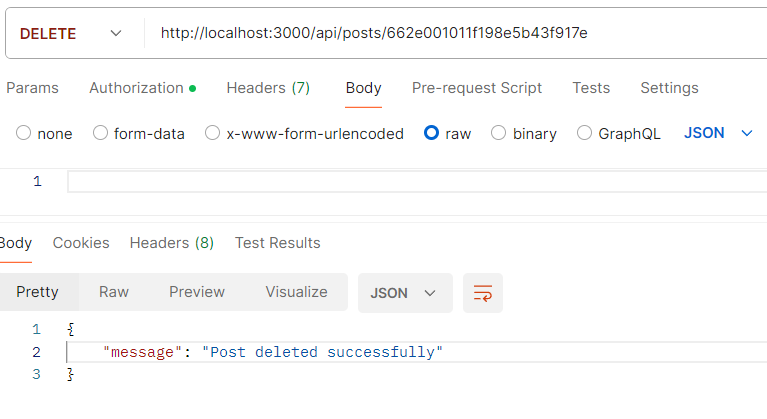

# Blogging Platform API

This API provides endpoints for managing blog posts.

## Endpoints

### GET `/api/posts`

Retrieve a list of all posts.


#### Query Parameters:

- `page`: Page number (default: 1)
- `limit`: Number of items per page (default: 10)

#### Authorization:

Add Read role Authorization: Bearer <jwt_token_generated>

#### Response Format:

```json
{
    "totalPosts": 4,
    "totalPages": 1,
    "currentPage": 1,
    "posts": [
        {
            "_id": "662df888c0a52c65d13e7283",
            "title": "Top 3 Science Fiction Books",
            "content": "1. Dune by Frank Herbert\n2. The Hitchhiker's Guide to the Galaxy by Douglas Adams\n3. Neuromancer by William Gibson",
            "author": "JohnDoe",
            "creationDate": "2024-04-28T07:19:36.614Z",
            "__v": 0
        }...
    ]
}
```

### POST `/api/posts`

Create a new post.

#### Request Body:
```json
{
    "title": "Top 3 Books To Read",
    "content": "1.Living in the Light 2. Give and Take 3. Resisting Happiness",
    "author": "JohnDoe"
}
```
#### Authorization:

Add Write role Authorization: Bearer <jwt_token_generated>


#### Response Format:
```json
{
    "title": "Top 3 Books To Read",
    "content": "1.Living in the Light 2. Give and Take 3. Resisting Happiness",
    "author": "JohnDoe",
    "_id": "662e001011f198e5b43f917e",
    "creationDate": "2024-04-28T07:51:44.155Z",
    "__v": 0
}
```

### GET `/api/posts/:postId`

Retrieve a post by ID.

#### Response Format:
```json
{
    "_id": "662e001011f198e5b43f917e",
    "title": "Top 3 Books To Read",
    "content": "1.Living in the Light 2. Give and Take 3. Resisting Happiness",
    "author": "JohnDoe",
    "creationDate": "2024-04-28T07:51:44.155Z",
    "__v": 0
}
```


### PUT `/api/posts/:postId`

Update a post by ID.

#### Request Body:
```json
{
  "title": "Top 3 Books of all time",
  "content": "1.Living in the Light 2. Give and Take 3. Resisting Happiness"
}
```
#### Authorization:

Add Write role Authorization: Bearer <jwt_token_generated>

#### Response Format:
```json
{
    "_id": "662e001011f198e5b43f917e",
    "title": "Top 3 Books of all time",
    "content": "1.Living in the Light 2. Give and Take 3. Resisting Happiness",
    "author": "JohnDoe",
    "creationDate": "2024-04-28T07:51:44.155Z",
    "__v": 0
}
```


### DELETE `/api/posts/:postId`

Delete a post by ID.

#### Authorization:

Add Administer role Authorization: Bearer <jwt_token_generated>

#### Response Format:
```json
{
    "message": "Post deleted successfully"
}
```


## Authentication and Authorization

This API requires authentication using JSON Web Tokens (JWT). Users with the appropriate roles (Read, Write, Administer) can perform certain actions on the posts.

### Register

To register a new user, send a POST request to `/api/auth/register` with the following request body:
```json
{
    "username": "Yash@dev",
    "password": "dev@3214"
}
```


### Sign In

To sign in a user, send a POST request to `/api/auth/signin` with the following request body:
```json
{
  "username": "Yash@dev",
  "password": "dev@3214"
}
```
Upon successful sign-in, the response will include a appropriate message & JWT token, which you can include in subsequent api requests to authenticate the user.


## Running the Application

Follow these steps to run the application:

- Install dependencies:
```bash
npm install
```
- Set up environment variables:
Create a .env file in the root directory and specify the following variables:
```
PORT=3000
MONGODB_URI=<your_mongodb_uri>
JWT_SECRET=<your_jwt_secret>
```

- Start the server:
```bash
npm start
```
The server will start running on the specified port (default: 3000) and connect to the MongoDB database.

## Running Unit Tests

To run the unit tests, use the following command:

```
npm test
```
